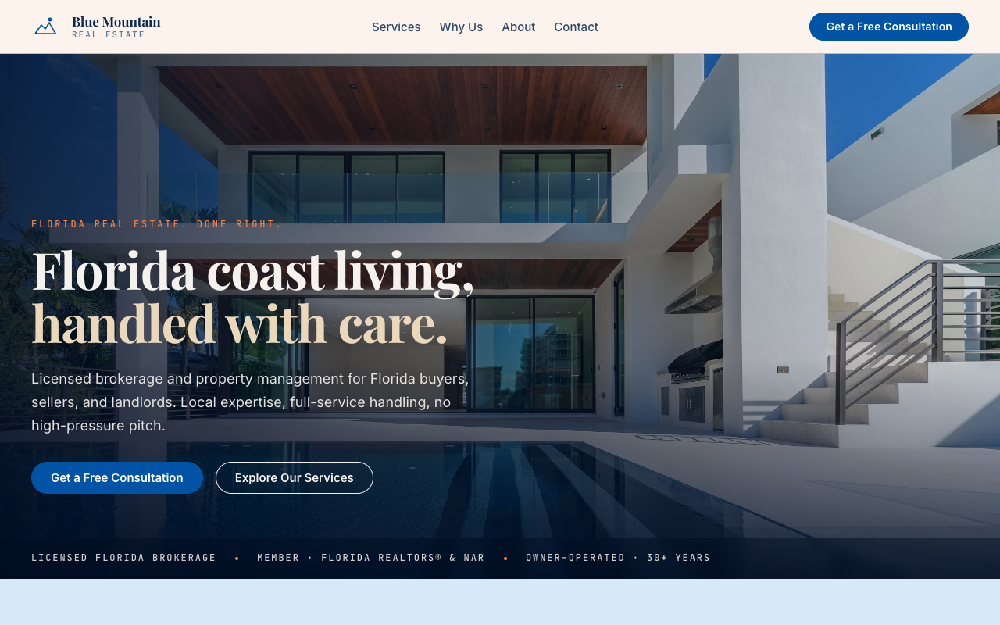

# Blue Mountain Real Estate

> Florida residential brokerage & property management — buy, sell, or rent with a team that handles the whole transaction, end to end.



A fast, static marketing site for a licensed Florida real estate brokerage. Built with Astro, it presents the firm's services (buying, selling, rental & property management), credentials, and a low-friction email contact flow — all in a coastal-luxury visual language.

**Live:** <https://bluemountainrealestate.pages.dev> · custom domain <https://bluemountainreal.com>

---

## Tech stack

| Layer        | Choice                                   |
| ------------ | ---------------------------------------- |
| Framework    | [Astro 5](https://astro.build) (static)  |
| Styling      | Tailwind CSS v4 (via `@tailwindcss/vite`) + CSS custom-property design tokens |
| Language     | TypeScript                               |
| Images       | Sharp (build-time optimization)          |
| SEO          | `@astrojs/sitemap`, JSON-LD structured data |
| Hosting      | Cloudflare Pages (manual Wrangler deploy) |

## Getting started

Requires Node 18+ and npm.

```bash
npm install      # install dependencies
npm run dev      # start the dev server at http://localhost:4321
```

### Scripts

| Command           | What it does                              |
| ----------------- | ----------------------------------------- |
| `npm run dev`     | Start the local dev server (port 4321)    |
| `npm run build`   | Build the static site to `dist/`          |
| `npm run preview` | Preview the production build locally      |
| `npm run check`   | Type-check with `astro check`             |

## Project structure

```
src/
  components/      Nav, Footer, SeoHead, JsonLd
  layouts/         BaseLayout.astro (html shell, fonts, skip-link)
  lib/             site.ts (brand/content constants), seo.ts (JSON-LD helpers)
  pages/           index.astro (the single landing page)
  styles/
    tokens.css     design tokens — colors (OKLCH), type scale, spacing, motion
    global.css     reset, layout primitives, buttons, Tailwind import
public/            favicon, robots.txt, _headers
```

## Design system

- **Type:** Playfair Display (display) + Inter (body) + JetBrains Mono (labels), loaded via Google Fonts.
- **Palette:** deep navy `#1d396b` + soft coastal blue on warm cream, with a sunset-coral accent used sparingly. Defined as OKLCH tokens in `src/styles/tokens.css` — reference tokens by name, never inline raw color values.
- **Macrostructure:** full-bleed coastal "Marquee Hero" → image-led service cards → why-us split → Miami-skyline statement band → two-column About → email contact.
- Hero imagery is high-resolution coastal/Florida photography (currently Unsplash; swap for the client's own property photos when available).

## Deployment

> **Important:** this project is **not** connected to CI. Pushing to `main` updates source history on GitHub but does **not** deploy. Deploys are a manual Wrangler upload to Cloudflare Pages.

### Deploy a new version

```bash
npm run build

CLOUDFLARE_ACCOUNT_ID=1970adb1e46723e496688fd63f555875 \
  npx wrangler pages deploy dist \
  --project-name=bluemountainrealestate \
  --branch=main \
  --commit-dirty=true
```

- **Pages project:** `bluemountainrealestate`
- **Cloudflare account:** Senior Income Properties (account ID above — not a secret; the auth token lives in your local `wrangler login`). The account ID must be set explicitly because the Wrangler token has access to several accounts.
- Authenticate once with `npx wrangler login` (or `wrangler whoami` to confirm) before deploying.

After a successful deploy, Wrangler prints the deployment URL; production is always <https://bluemountainrealestate.pages.dev>.

## Related sites

Part of a small family of sister companies sharing this design base:

- **Florida Tradition Builders** — custom coastal construction
- **Senior Income Properties** — attorney-directed real estate for elder-law / Medicaid planning

## License

Private — © Blue Mountain Real Estate. All rights reserved.
